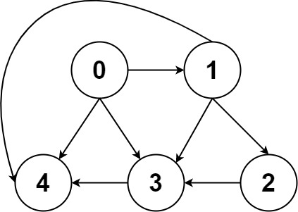

图图是由节点和边构成的，图和多叉树的最大区别在于图可能有环:



所以在遍历过程中需要有一个visited数组来记录已经遍历的点，和回溯树的处理逻辑比较相像。

遍历框架：
```java
/**
 * 二叉树遍历
 */
void traverse(TreeNode node){
    if(node==null) return null;
    traverse(node.left);
    traverse(node.right);
}

/**
 *多叉树遍历
 */
void traverse(Node node){
    if(node==null) return null;
    for(Node child:node.childs){
        traverse(child);    
    } 
}

/**
 * 图遍历框架
 */
boolean[] visited;
void traverse(Graph graph,int vertex){
    if(visited[vertex]==true) return;
    visited = true;
    for(Graph neighbor: graph.neighbors(vertex)){
        traverse(graph,neighbor);    
    }
}

```