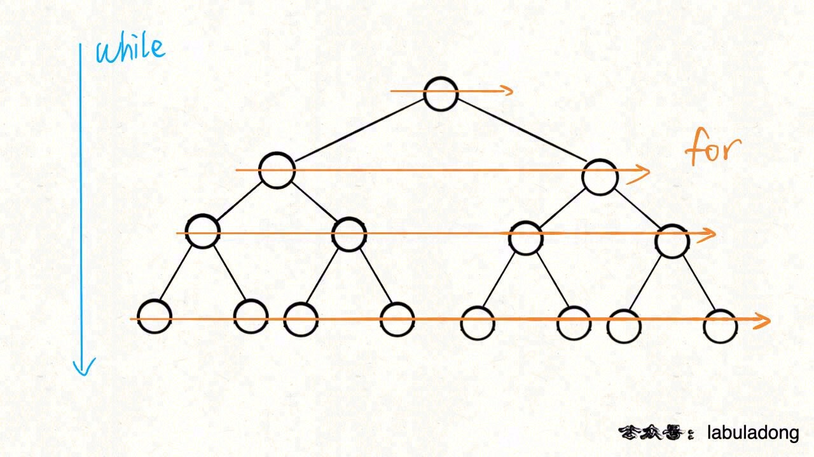

BFS广度优先搜索框架：

BFS相对的是DFS，BFS中一般用队列，在遍历当前层级的节点时，把下层节点存储到队列变量中，保证先处理当前层级的节点。

回溯属于DFS，它用函数递归的方式，相当于用函数栈存储节点的信息，转换成迭代法。

BFS--队列

DFS--栈

```java
BFS算法题模板
bfs(Node start,Node target){
    Queue<Node> queue = new LinkedList<Node>();
    LinkedHashSet<Node> visited = new LinkedHashSet<>();

    queue.offer(start);//将起点加入队列
    int step = 0;
    while(!queue.isEmpty()){
        int sz = queue.size();//sz的大小代表了当前节点拥有的选择数量,注意这里要先用变量来保存栈的宽度，不然在循环中queue的size是不断改变的，会导致死循环。
        /* 将当前队列中的所有节点向四周扩散，这次for循环代表遍历了这个位置上的所有选择，所以step要在这个for循环之后才进行递增*/
        for(int i = 0; i<sz;i++){
            Node current = queue.poll();
            if(current is target){
                return step;
            }
            for(Node nextNode : current.nexts){
                if(!visited.contains(nextNode)){
                    queue.offer(nextNode);
                    visited.add(nextNode);
                }
            }

        }   
        /* 重点：在这里更新结果 */
        step++;
    }
    return -1;//没有搜索到结果
}
```



这里注意这个 while 循环和 for 循环的配合，while 循环控制一层一层往下走，for 循环利用 sz 变量控制从左到右遍历每一层二叉树节点