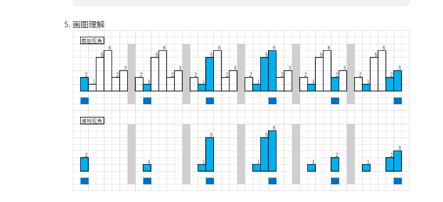

单调栈
单调栈分为单调递增栈和单调递减栈
11. 单调递增栈即栈内元素保持单调递增的栈

同理单调递减栈即栈内元素保持单调递减的栈
操作规则（下面都以单调递增栈为例）
21. 如果新的元素比栈顶元素大，就入栈

如果新的元素较小，那就一直把栈内元素弹出来，直到栈顶比新元素小
加入这样一个规则之后，会有什么效果
31. 栈内的元素是递增的

当元素出栈时，说明这个新元素是出栈元素向后找第一个比其小的元素
举个例子，配合下图，现在索引在 6 ，栈里是 1 5 6 。
接下来新元素是 2 ，那么 6 需要出栈。
当 6 出栈时，右边 2 代表是 6 右边第一个比 6 小的元素。

当元素出栈后，说明新栈顶元素是出栈元素向前找第一个比其小的元素
当 6 出栈时，5 成为新的栈顶，那么 5 就是 6 左边第一个比 6 小的元素。


##单调栈的意义：用 O(n) 复杂度的一重遍历找到每个元素前后最近的更小/大元素位置

代码模板
```C++
C++
stack<int> st;
for(int i = 0; i < nums.size(); i++)
{
while(!st.empty() && st.top() > nums[i])
{
st.pop();
}
st.push(nums[i]);
}
```


作者：Ikaruga
链接：https://leetcode.cn/problems/largest-rectangle-in-histogram/solutions/108083/84-by-ikaruga/
来源：力扣（LeetCode）
著作权归作者所有。商业转载请联系作者获得授权，非商业转载请注明出处。